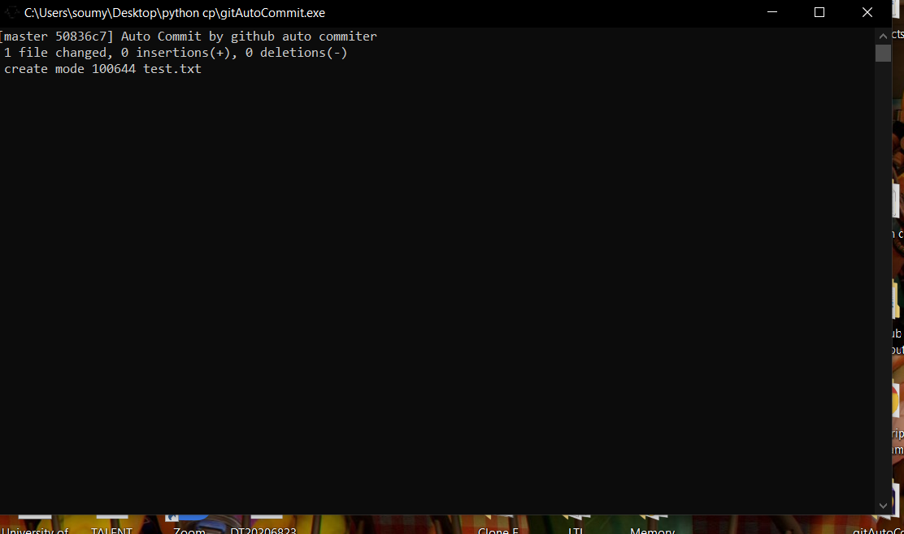
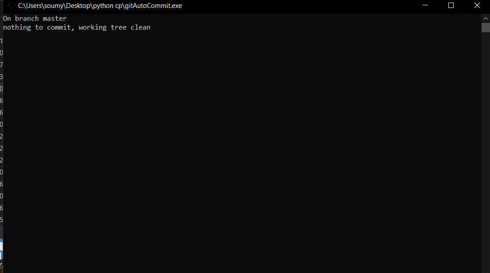

# Github Auto Commiter

Automatically commit your git directory with this application.

## Installation

Download the .exe file and place it in your git initialized folder. It will automatically commit your work every 60 minutes.
## Working Screenshots
 

## Contributing
Pull requests are always welcome. TIA <3

## License
[MIT](https://choosealicense.com/licenses/mit/)
